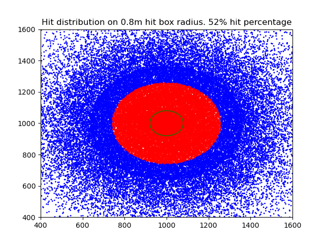
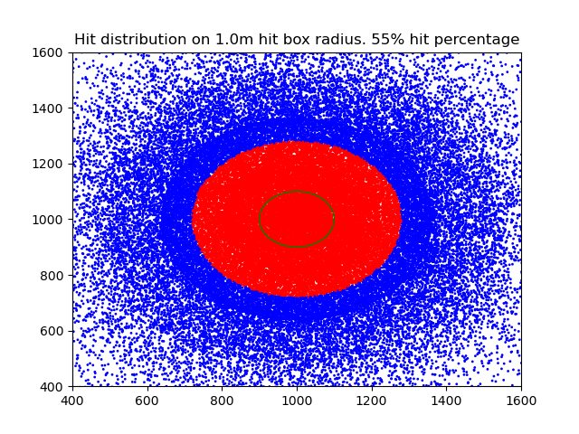

# Average overlaps count for poisonous concoction of

Transfigured [Poisonous concoction](https://www.poewiki.net/wiki/Poisonous_Concoction) jumps in random direction on hitting terrain, if there are remaining chain.
This simulation plots a typical situation to estimate number of overlaps based on target hit box.

Hit box sizes used are in range of 0.2m - 1m, 0.2m being a humanoid hitbox (smallest possible?).
Chains amount is 7 (8 hits total).

# TLDR

~ 43% overlaps or more if chaining range = pconc radius
~ 75% overlaps or more if chaining range = 50% of pconc radius

# Plots

If chaining range matches pconc radius

## 0.2m enemy hitbox

## 0.4m enemy hitbox

## 0.6m enemy hitbox

## 0.8m enemy hitbox

## 1.0m enemy hitbox

# Plots

If chaining range is half of pconc radius

## 0.2m enemy hitbox

## 0.4m enemy hitbox

## 0.6m enemy hitbox

## 0.8m enemy hitbox

## 1.0m enemy hitbox

